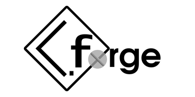
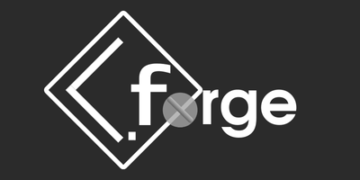

# CmdForge

[English](READMEEN.md) | 简体中文

<p align="center">
  
  
</p>

<p align="center">
  
  
  
</p>

命令行界面（CLI）构建框架，助您快速开发跨平台命令行工具。

## 项目简介

**CmdForge** 是一个基于C++的命令行工具构建框架，帮助开发者快速实现命令行工具。项目提供完整的示例代码和文档说明。

### 一些特性

1. **小巧便携** - 单一头文件 & 源文件 ^，无需额外依赖。
2. **开发高效** - 类方法调用式的构建方式，快速上手
3. **功能完备** - 支持子命令、参数配置 ^^ 、自动帮助生成
4. **平台兼容** - 支持 Windows、Linux 和 macOS ^^^

*^ 实际上，需要你自行创建包装函数头文件（关于包装函数的概念，请查阅开发文档或通过示例中的 API.h 进行参考）*\
*^^ 当前版本中，并未完全支持*\
*^^^ 特定平台进行测试，具体功能可能存在差异*

### 使用方法

在 `doc/` 目录中，你应该收到了一系列详细的开发文档，详细介绍了系统设计架构和 Demo 示例讲解。

## 示例构建

在 `src/` 目录下，包含有 **CmdForge** 构件库的代码文件夹 `lib` ，项目更新日志文件夹`log` 以及一套完整示例，即 `Demo.cpp` 和 `API.h`，通过我们提供的示例代码，你应该可以快速了解 **CmdForge** 的构建方式和运行效果。

### 环境要求
- C++14+ 兼容编译器
- CMake 3.15+（推荐使用最新稳定版）

### 构建步骤
```bash
# 克隆仓库
git clone https://github.com/KenanZHu/CmdForge.git
cd CmdForge

# 创建构建目录
mkdir build
cd build

# 生成构建系统
cmake ..

# 编译项目
cmake --build .
```

### 平台构建

### Windows
- **推荐环境**：Visual Studio 2022 + CMake 集成
- **注意**：原生 CMD 终端可能无法正确处理ANSI转义码，建议使用：
  - [Windows Terminal](https://aka.ms/terminal)
  - [MSYS2](https://www.msys2.org/) 终端
- **CMake配置示例**：
```bat
cmake -G "Visual Studio 14 2022" -A x64 ..
```

### Linux
- **已测试环境**：
  - Ubuntu 24.10 (x86_64) with GCC 13.2
- **依赖安装**：
```bash
sudo apt-get install build-essential cmake
```

### macOS
- **环境配置**：
```bash
# 安装Xcode命令行工具
xcode-select --install

# 使用Homebrew安装CMake
brew install cmake
```

## 文档说明

完整开发文档位于 `doc/` 目录：

|文档名称|内容概要|
|:-:|:-:|
|[架构设计文档](./doc/ArchDesign.md)|框架模块结构与Demo详细介绍|
|[API参考手册](./doc/APIGuide.md)|核心类与方法详细说明|

## 问题反馈
请通过 [GitHub Issues](https://github.com/KenanZHu/CmdForge/issues) 提交问题，需包含：
1. 操作系统版本
2. 编译器版本
3. 最小可复现代码
4. 实际输出与期望输出

## 许可协议

本项目采用 [GNU GPLv3 许可证](LICENSE)，允许自由使用和修改，但需保留原始版权声明。

## 联系方式

- 项目维护：KenanZhu (Nanoki)
- 电子邮箱：<nanoki_zh@163.com>
- 技术交流：提交 Issue 或 Pull Request

---

_**Free to use** —— CmdForge_