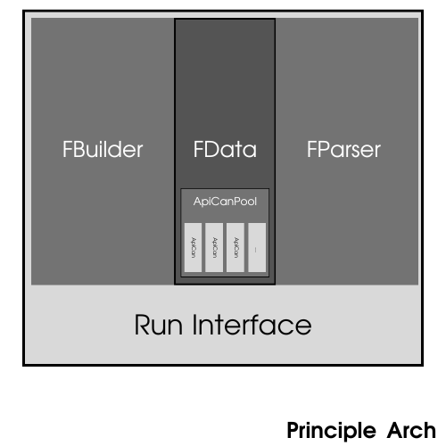
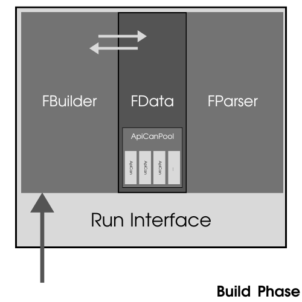
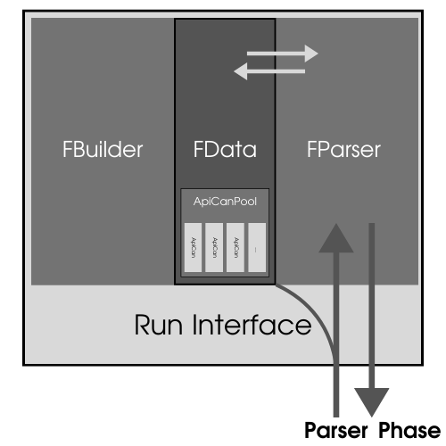

*文档导航*

| [*自述文档*](../README.md) | [*API参考手册*](APIGuide.md) | *架构设计文档* |

---

## CmdForge-架构设计文档

---

### 基本原理

<p align="center">
    
</p>

如图所示，**CmdForge** 的命令行界面维持类 **ForgeHwnd** 主要由 **FBuilder** 类和 **FParser** 类继承而来（*关于类及其方法的详细说明请见文档：[API参考手册](APIGuide.md)*）。这里的 **FBuiler** 和 **FParser** 虚继承自 **FData** 。通过虚继承机制，**ForgeHwnd**作为最终派生类将持有唯一的 **FData** 实例，**FData** 主要负责维护回调函数类 **ApiCan** 池 **ApiCanPool** 。整体继承结构呈现菱形虚继承架构。

<p align="center">
    
</p>

如图所示，构建阶段，通过 **ForgeHwnd** 类方法进行调用式构造，并通过 **FBuilder** 类处理构造参数最终访问并修改 **FData** 维护的 **ApiCanPool** ，记录并管理构造阶段产生的数据和元数据。

<p align="center">
    
</p>

用户输入命令，经过 **ForgeHwnd** 捕获并通过调用 **FData** 的数据处理方法将原始输入转换为标准格式后经由 **FParser** 处理后使用内部方法访问并调用 **FData** 中 **ApiCanPool** 中的回调函数，由此完成命令的解析和调用。

## 实例构建详细说明

> [!NOTE]
> 这里的示例代码采用方法接口适用的 CmdForge 构建库最低版本为 1.0.7。

首先定义一些重要的概念：

**CLI**：

命令行界面（Command Line Interface）。通过命令行输入指令，程序执行相应的操作，相比于图形界面，命令行界面更加简洁和高效，可以进行更为复杂的任务。

**主命令**：

主命令是用户输入的第一个单词，用于标识命令的类型，一般为程序的缩写或名称，例如 “git” ，“cmake”...。

**子命令**：

子命令是主命令的一部分，用于进一步指定命令的具体操作，简单来说，子命令可以分为如下两种基本格式：

1. 子命令 + 参数
2. 子命令 + 选项 + 参数

例如，在 git 中，子命令 “commit” 就可以分为如下两种格式：

1. commit + 参数
2. commit + -m + 参数

当然类似于如下的复杂格式也是可以的：

1. 子命令 +（默认选项）+ 参数
2. 子命令 + 选项 + 参数 + 选项 + 参数
3. 子命令 + 选项 + 参数 + 参数 + 选项 + 参数 + 参数
4. 子命令 +（默认选项）+ 参数 + 选项 + 参数
5. ...

这里不再赘述举例。

**命令**：

命令是由主命令和子命令组成的一个完整的指令，由于子命令的格式不同，因此命令的格式也大体上分为两类：

1. 主命令 + 子命令 + 参数
2. 主命令 + 子命令 + 选项 + 参数
3. ...

**CmdFogre** 对上述的命令格式有较为完整的支持。

**包装函数**：
    
接受一个二维的 *std::string* 向量容器作为唯一的参数，且返回值为 *void* 的函数。其中该二维向量容器的结构如下图所示：

```
std::vector<std::vector<std::string>> OptArgs;

__|___0___|___1___|___2___|___3___|...
0 |CmdName|CmdName|...    |...    |...     // 该包装函数对应的命令名称，如果数量不止一个则按顺序填入。
1 |OptName|ArgName|...    |...    |...     // 该命令的选项名称和选项跟随的参数名称。
2 |OptName|ArgName|ArgName|...    |...     // 同上。
3 |OptName|ArgName|...    |...    |...     // 同上。
...

```

需要注意的是，对于参数和选项 **CmdForge** 会将其进行统一处理为上述数据结构，因此在包装函数中，你需要处理选项和附带的参数。

**Hook**：

将至少一个子命令和一个包装函数进行绑定（或建立链接）的过程。

**Fork**：

通过给定的命令，将该命令传入包装函数进行调用的过程。

正如上文提到，**CmdForge** 的构建方法是基于类方法的。也就是说，你只需要实例化一个命令行界面维持类即可完成交互界面的搭建。不过，除此之外，还有一些其它的准备工作。

这里我们引入 **包装函数** 的概念。该包装函数需要你自己创建一个包装函数头文件。在 demo 实例中创建了头文件 **API.h** 。其中包装函数主要参数和构造类型如下所示：

```cpp
// 包装函数模板

void PackageFunc(std::vector<std::vector<string>>)
{
	// 这里添加你自己的参数处理逻辑

	// 当然，可以在这里调用你自己的API，需要注意的是，该包装函数只起到回调
	// 的作用，并不负责相应参数的类型的判断和转换的工作。
	return;
}
```

该函数接受一个二维的 *std::string* 向量容器参数，里面包含了经由 **FParser** 分析处理后的命令选项和参数数据。返回类型为 *void*。

在 **API.h** 的具体实例中包含了两个包装函数如下：

```cpp
//  \FILE  : APIs.h
//  \BRIEF : 在这里创建你的API包装函数。

#pragma once

#include <vector>
#include <iostream>

using namespace std;

////    包装函数必须是如下的形式:
////
////    ' void (*) (vector<vector<string>>) '
////
////    其它类型无法进行使用.

void process_1(vector<vector<string>> OptArgs)
{
////    详细的代码逻辑实现如下
///////////////////////////////////////////////////////////
	cout<<"SUCCESS !"<<endl;

///////////////////////////////////////////////////////////
////    在这里判断和转换 '[-opts]' 和 '[-args]'参数 
///////////////////////////////////////////////////////////

///////////////////////////////////////////////////////////
////   在这里通过转换后的'[-opts]' 和 '[-args]'数据来调用
////   你的函数API或者直接在这里编写逻辑
///////////////////////////////////////////////////////////
	return;
}
void process_2(vector<vector<string>> OptArgs)
{
////    和上述同理
	cout<<"SUCCESS !"<<endl;
///////////////////////////////////////////////////////////
	return;
}
```

这里生明并定义了两个包装函数：*process_1*  和  *process_2* ,具体说明参见代码中注释。

接下来是主体界面的构建方式，在主函数中我们首先需要包含 **CmdForge** 库的头文件 **CmdForge.h** 和包装函数的头文件(在demo实例中我们指 **API.h** ）。首先需要创建一个 **ForgeHwnd** 类的实例，根据需要可以创建CLI配置数据结构体；命令选项格式数据；命令选项参数格式数据。接下来同样以demo实例中的 **Demo.cpp** 文件进行详细的说明和介绍。

下面是**Demo.cpp**文件的详细内容：

```cpp
//
// 注释部分省略
//

#include "APIs.h"                 // 你的API包装函数。
#include "./lib/CmdForge.h"       // 'CmdForge' 构建库头文件。

int main(int args,char *argv[]) 
{
    // 初始化你的 'CmdForge'
    ///////////////////////////////////////////////////////
    ForgeHwnd CLIF(argc,argv);    // CLI 主界面维持类。
                                  // (使用默认构造函数只支持交互模式)
    ArgFmtData ArgFmt={0};        // 选项参数格式数据。
    CLICfgData CLICfg={0};        // CLI 配置数据。.
    OptFmtData OptFmt={0};        // 选项格式数据。
    
    // 设置CmdForge的运行参数
    ///////////////////////////////////////////////////////
    CLICfg.InputSleTime=20;
    CLICfg.DetectSleTime=20;      // 建议设置在 '10-100' 范围内.
    CLICfg.MaxStoredCmd=20;
    CLICfg.ProgramName="Demo Process";
    CLICfg.Version="1.0.0.0";
    CLIF.SetCLICfg(CLICfg);

    // 另外，你可以通过如下方式设置你的 CLI 配置数据 (于1.0.3版本后支持)
    //
    // CLICfg.SetCLIMode(int Mode);
    //
    // CLICfg.SetCLIVersion(std::string Version);
    
    // 设置你的主命令
    ///////////////////////////////////////////////////////
    CLIF.SetCLIMainCmd("test");
    
    // 将命令与包装函数进行连接
    ///////////////////////////////////////////////////////
    CLIF.SetCLIMainCmd("proc");

    CLIF.HookCmdApi("-start",process_1);
    CLIF.SetCmdBrief("-start","start main process");

    CLIF.HookCmdApi("-do",process_2);
    CLIF.SetCmdBrief("-do","do process");

    CLIF.HookCmdApi("-stop",process_3);
    CLIF.SetCmdBrief("-stop","stop process");

    CLIF.HookCmdApi("-end",process_4);
    CLIF.SetCmdBrief("-end","end main process");

    OptFmt.LongFmt="--id";
    OptFmt.ShortFmt="-i";
    OptFmt.Brief="process id";
    OptFmt.Args.push_back(ArgFmt);
    OptFmt.OptType=OPTYPE_D|OPTYPE_M;
    CLIF.SetCmdOpt("-do",OptFmt);
    CLIF.SetCmdOpt("-stop",OptFmt);

    OptFmt.LongFmt="--task";
    OptFmt.ShortFmt="-t";
    OptFmt.Brief="process task";
    OptFmt.OptType=OPTYPE_M|OPTYPE_R;
    CLIF.SetCmdOpt("-do",OptFmt);
    CLIF.SetCmdOpt("-stop",OptFmt);

    OptFmt.LongFmt="--occupy";
    OptFmt.ShortFmt="-o";
    OptFmt.Brief="process occupy";
    OptFmt.OptType=OPTYPE_O;
    CLIF.SetCmdOpt("-do",OptFmt);
    CLIF.SetCmdOpt("-stop",OptFmt);

#ifdef _TEST0

    // 1.
    CLIF.HookCmdApi("-do",process_2);

    // 2.
    CLIF.HookCmdApi("-do",process_1);

    // 3.
    CLIF.HookCmdApi("-chk",nullptr);

    // 4.
    CLIF.HookCmdApi("-chk","-do");
    CLIF.HookCmdApi("-do","-do");
    CLIF.HookCmdApi("-do","-stop");

#endif

#ifdef _TEST1
    
    // 1.
    CLIF.HookCmdApi("--startit",process_1);
    CLIF.HookCmdApi("--doit",process_2);
    CLIF.HookCmdApi("--stopit",process_3);
    CLIF.HookCmdApi("--endit",process_4);

    // 2.
    CLIF.HookCmdApi("-do","-dothis");
    CLIF.HookCmdApi("-stop","-stopthis");

#endif
    
    // 启动主循环
    ///////////////////////////////////////////////////////
    CLIF.MainLoop();
    
    return 0;
}
```

在上述文件源程序中，我们设置了 **CLI** 的主命令：“test”，同时借助 **ForgeHwnd** 的 **HookCmdApi** 方法添加了四个自定义子命令：“-start”，“-do”，“-stop”，“-end”。并且设置了三个不同类型的自定义选项，将其添加到选项“-do”和“-stop”中。因此在 **CmdForge** 中允许两种命令格式：

```bash
{$ MainCmd} {$ -SubCmd}

proc -start

{$ MainCmd} {$ -SubCmd} [{$ -Opt} [{$ -Args}](s)](s)

proc -do -i 01 -t swap -o 12bit
```

第一种格式，只包含主命令和子命令，没有选项和参数。\
第二种格式，包含主命令、子命令和选项，其中选项可以是必选可重复的，也可以是必选的，也可以是可重复的。
另外对于设置为默认属性的选项，**CmdForge** 会将子命令后没有选项起始的参数自动认作为默认选项参数，并进行后续的处理，例如下列命令：

```bash
maincmd -subcmd arg1 arg2 -opt2 arg1 arg2 -opt3 arg1 arg2
```

如若该子命令中包含默认选项 **-opt1** ，**CmdForge** 认为该命令与下列命令等价：

```bash
maincmd -subcmd -opt1 arg1 arg2 -opt2 arg1 arg2 -opt3 arg1 arg2
```

在示例中，选项“-a/--along”的选项属性设置为默认可选项，“-b/--blong”的选项属性设置为必选可重复，“-c/--clong”的选项属性设置为必选。

此外，在该示例中，我们提供了两个测试模块，分别为 **_TEST0** 和 **_TEST1**。你可以在项目中添加对应的预编译宏选择测试模块。

在测试模块 **_TEST0** 中，我们举出了三种会引起CmdForge输出警告信息并终止运行的情况：

1.  同一个命令 Hook 到不同的包装函数。
2.  重复的 Hook 操作。
3.  Hook 指向为空的包装函数。
4.  由于 1.0.7 引入的新的 Hook 方法，产生了以下新的情况：
    a.  Hook 新命令到不存在的目标命令。
    b.  Hook 的新命令与目标命令相同（ c. 的特殊情况）。
    c.  Hook 已经存在的命令作为新命令。

在测试模块 **_TEST1** 中，我们给出了一个命令 Hook 其它用法的示例：

1.  不同的命令可以 Hook 到同一个包装函数。
2.  直接使用 Hook 为已存在命令添加新命令。

这意味着你可以为同一个包装函数提供两种及以上不同的子命令来调用它。如下示意：

```bash
proc -do ... == proc -doit... == proc -dothis...
```

## 自行构建说明

该部分请参照 demo 实例中给出的使用方法，结合[API参考手册](APIGuide.md)内容的类和方法，进行构建。

提示：需要注意，由于项目尚处于早期阶段，本文档的示例代码会与当前版本有所不同，请以最新版本的 demo 示例为准。